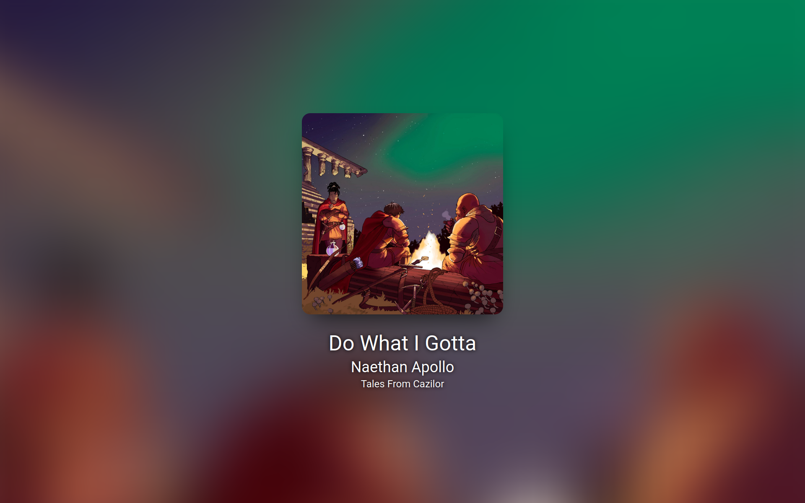

# fancy-spotify-gui

A little experiment to grab data over `playerctl` and display it in a GUI for showing song information

## Installation
- Clone the repository with `git clone https://github.com/nfoert/fancy-spotify-gui`
- Create a new virtual enviroment with `python -m venv .venv` and activate it with `source ./.venv/bin/activate`
- Install the required packages with `pip install -r requirements.txt`

## Usage
Make sure the Spotify client is running and a song is playing
- Run the server using `python main.py`
- Go to `127.0.0.1:8000` in your browser to see the website.

## Todo
- [ ] Animate text change
- [ ] Smart recheck song data when the song's about to end, instead of every second
- [ ] Add playback buttons
- [ ] Animate cover art if paused